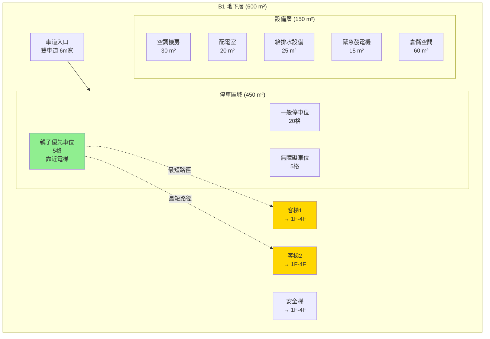
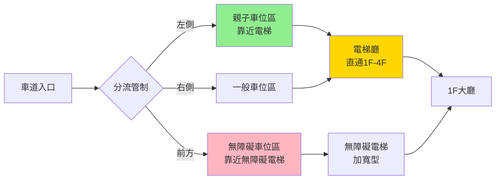
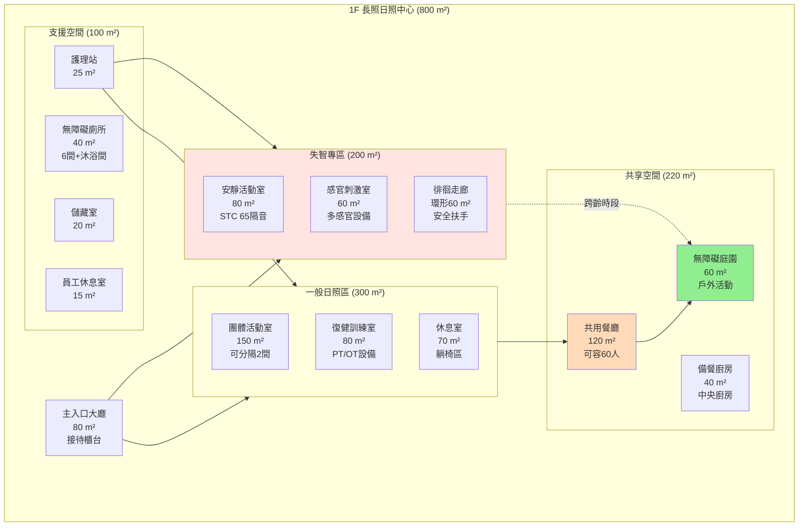
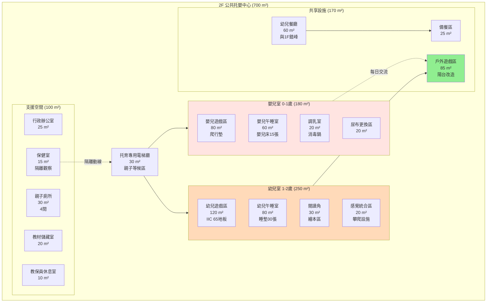
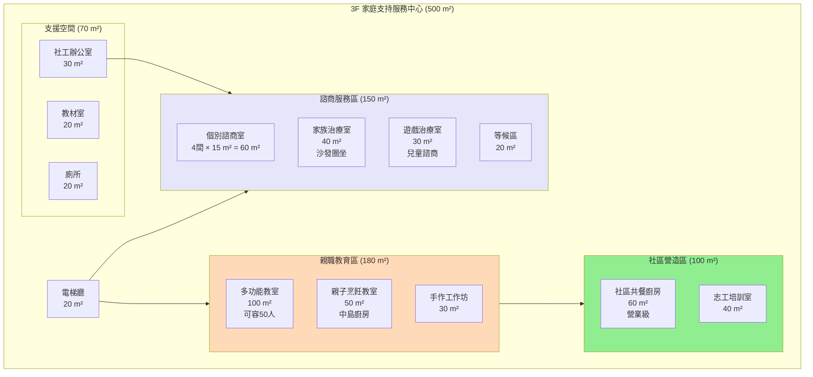
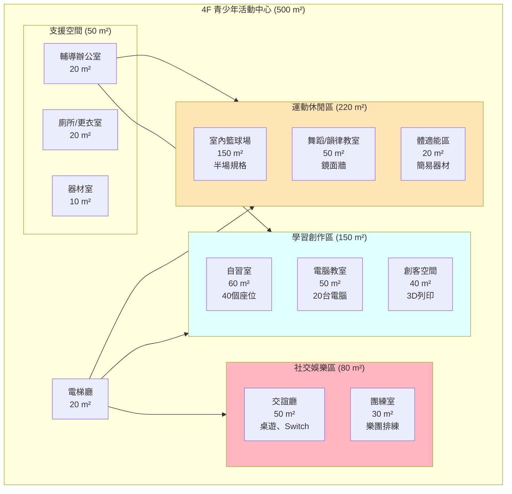

# 赤土崎全齡社福樞紐 - 建築樓層配置詳細設計

**專案代號**: 赤土崎多功能館建築設計方案
**報告日期**: 2025年10月23日
**基於文件**: Identification-of-cross-age-care-needs-patterns.md 可行性分析
**設計目標**: 4層樓整合型社福設施（B1+4F）

---

## 📐 建築總覽

### 基本資訊
```
總樓地板面積: 約2,800-3,200 m² (850-970坪)
建築樓層: 地下1層 + 地上4層
建築高度: 約18-20公尺
結構型式: 鋼筋混凝土構造
耐震設計: 建築技術規則耐震設計規範（Class II）
```

### 樓層功能分配

| 樓層 | 主要功能 | 使用面積 | 服務人數 | 使用時段 |
|------|---------|---------|---------|---------|
| **4F** | 青少年活動中心 | 500 m² | 30-40人 | 17:00-21:00 |
| **3F** | 家庭支持服務 | 500 m² | 20-30人 | 18:00-21:00 |
| **2F** | 公共托嬰中心 | 700 m² | 40-50人 | 07:30-17:30 |
| **1F** | 長照日照中心 | 800 m² | 50-60人 | 09:00-17:00 |
| **B1** | 停車場+設備層 | 600 m² | 30車位 | 全日 |
| **總計** | - | **3,100 m²** | **140-180人** | - |

---

## 🏗️ B1 地下層：停車場與設備層

### 平面配置圖



### 空間詳細規格

#### 1. 停車區域 (450 m²)

**車位配置**:
- 一般停車位：20格（2.5m × 5.0m）
- 無障礙車位：5格（3.5m × 5.0m）+ 下車區1.5m
- 親子優先車位：5格（2.5m × 5.5m）+ 娃娃車空間
- **總計：30車位**

**停車需求推估**:
```
尖峰時段（08:00-09:00 & 17:00-18:00）：
├── 托育家長接送：15車次/小時
├── 長照家屬接送：10車次/小時
├── 青少年家長：5車次/小時
├── 工作人員：8車位（全日）
└── 總需求：38車次/小時 → 30車位滿足90%需求

離峰時段：
└── 約12-15車位使用率
```

**動線設計**:


**安全設計**:
- 照明：LED 150 lux 以上
- 監視器：每15公尺1支 CCTV
- 消防設備：每20公尺1組滅火器 + 自動灑水系統
- 通風：機械排煙系統（每小時換氣6次）

#### 2. 設備層 (150 m²)

**空調機房 (30 m²)**:
- 中央空調主機：2組（冷房能力150RT）
- 熱泵熱水器：2組（提供全館熱水）
- 新風交換系統：風量15,000 CMH
- **特殊設計**：HEPA H13過濾（符合CDC 2025標準）

**配電室 (20 m²)**:
- 主配電盤：800A
- 緊急照明系統
- UPS不斷電系統（支援監控設備）

**給排水設備 (25 m²)**:
- 水塔：20噸（3日儲水量）
- 污水處理設備：符合環保署標準
- 雨水回收系統：5噸（庭園澆灌使用）

**緊急發電機 (15 m²)**:
- 柴油發電機：100KW
- 緊急供電範圍：電梯、照明、監控、醫療設備

**倉儲空間 (60 m²)**:
```
分區儲存：
├── 長照物資區（20 m²）：輪椅、助行器、護理用品
├── 托育物資區（20 m²）：玩具、教材、備用寢具
├── 清潔用品區（10 m²）：清潔劑、消毒用品
└── 備用設備區（10 m²）：投影機、音響、活動器材
```

---

## 🏢 1F 一樓：長照日照中心

### 平面配置圖



### 空間詳細規格

#### 1. 失智專區 (200 m²)

**設計理念**：
- 低刺激、高安全、促進認知功能
- 色彩：暖色系（米白、淺木色、淺綠）
- 照明：間接照明 300-500 lux，避免眩光

**安靜活動室 (80 m²)**:
```
設備清單：
├── 可調高度桌椅：10組（適合輪椅使用者）
├── 懷舊治療素材：老照片、復古物品展示櫃
├── 音樂治療設備：藍牙音響、鋼琴鍵盤
├── 認知訓練桌遊：拼圖、記憶卡、積木
└── 隔音設計：STC 65（阻隔2F幼兒噪音）

容納人數：20-25人
使用時段：09:00-17:00
```

**感官刺激室 (60 m²)**:
```
多感官設備（Snoezelen）：
├── 視覺：光纖燈、泡泡管、投影星空
├── 聽覺：白噪音機、自然音效（流水、鳥鳴）
├── 觸覺：觸覺牆、不同材質物品
├── 嗅覺：香氛療法（薰衣草、柑橘）
└── 味覺：懷舊零食品嚐活動

用途：減緩焦慮、促進感官刺激
頻率：每日2次（10:00-11:00, 14:00-15:00）
```

**徘徊走廊 (環形60 m²)**:
```
安全設計：
├── 環形動線：無盡頭設計，減少焦慮
├── 扶手：雙側連續扶手（高度75cm & 90cm）
├── 防滑地板：止滑係數0.6以上
├── 導引標示：大字體、圖像化指標
├── 監控設備：每10m一支攝影機
└── 緊急按鈕：每5m一個護理呼叫鈕

防走失機制：
├── 電子門禁：感應卡+密碼鎖
├── 紅外線偵測：門口自動通報護理站
└── GPS手環：配戴於高風險個案
```

#### 2. 一般日照區 (300 m²)

**團體活動室 (150 m²)**:
```
空間彈性：
├── 可移動隔間：電動隔音牆（STC 50）
├── 分隔模式：2間75 m²獨立空間
└── 整合模式：150 m²大型活動場地

活動類型：
├── 體適能課程：銀髮瑜珈、太極拳（每周3次）
├── 藝術療法：繪畫、書法、手工藝（每周2次）
├── 音樂活動：合唱、樂器演奏（每周1次）
└── 代間活動：與2F幼兒共融（每周1次，10:00-11:00）

設備：
├── 投影設備：120吋電動布幕 + 4K投影機
├── 音響系統：8聲道環繞音響
├── 收納櫃：活動器材分類儲存
└── 可堆疊椅：60張（輕量化設計）
```

**復健訓練室 (80 m²)**:
```
物理治療（PT）設備：
├── 電動跑步機：2台（含扶手）
├── 固定式腳踏車：3台
├── 上肢訓練器：2台
├── 平衡訓練墊：5組
└── 治療床：2張

職能治療（OT）設備：
├── 日常生活訓練區：模擬廚房、浴室
├── 精細動作訓練：積木、串珠、寫字板
├── 認知訓練軟體：平板電腦5台
└── 輔具展示：助行器、輪椅試用

人員配置：
├── 物理治療師：1名（兼職，每周3天）
├── 職能治療師：1名（兼職，每周2天）
└── 照服員協助：2名
```

**休息室 (70 m²)**:
```
功能：
├── 午休空間：可躺式沙發椅10張
├── 閱讀區：書櫃、雜誌、放大鏡
├── 電視區：55吋電視 + 舒適沙發
└── 安靜區：遮光簾、降噪設計

使用時段：
├── 12:30-14:00：午休時段（高使用率）
└── 其他時段：自由使用
```

#### 3. 共享空間 (220 m²)

**共用餐廳 (120 m²)**:
```
座位配置：
├── 一般餐桌：10組（6人座）= 60人
├── 輪椅友善桌：3組（無桌腳設計）
└── 兒童餐椅：10張（跨齡共餐時使用）

分時使用策略：
├── 11:30-12:30：長者午餐（1F）
├── 12:00-13:00：幼兒午餐（2F，錯峰30分鐘）
├── 17:30-18:30：青少年晚餐（4F）
└── 假日10:00-11:00：跨齡共融早餐

設備：
├── 保溫餐車：3台
├── 飲水機：冷熱水各2台
├── 洗手台：6座（入口處）
└── 餐具消毒櫃：2台（高溫蒸氣）

無障礙設計：
├── 走道寬度：120cm以上（輪椅通行）
├── 地板材質：防滑磁磚（易清潔）
└── 緊急呼叫鈕：4個角落各1個
```

**備餐廚房 (40 m²)**:
```
設備：
├── 冷藏冷凍：營業用冰箱2台
├── 加熱設備：蒸飯箱、微波爐、保溫台
├── 洗滌設備：三槽式洗碗槽
├── 備餐台：不鏽鋼工作台4組
└── 排煙設備：抽油煙機（符合消防法規）

供餐模式：
├── 中央廚房外送：與社區共餐合作
├── 現場加熱配餐：由照服員協助
└── 特殊飲食：糖尿病餐、低鈉餐、管灌飲食

人員：
├── 廚務人員：1名（兼職）
├── 營養師：1名（顧問，每月訪視2次）
```

**無障礙庭園 (60 m²)**:
```
設計理念：
├── 園藝治療：長者種植蔬菜、香草
├── 兒童探索：沙坑、感官植物
├── 跨齡互動：共同澆水、觀察昆蟲

植栽配置：
├── 療癒植物：薰衣草、迷迭香、薄荷
├── 可食植物：小番茄、青蔥、九層塔
├── 感官植物：含羞草、狗尾草、棉花
└── 喬木：榕樹（提供遮蔭）

設施：
├── 無障礙步道：120cm寬，斜度1:12
├── 高架花台：高度75cm（輪椅可及）
├── 遮陽棚：50%區域有遮蔽
├── 休憩座椅：6組（含輪椅停靠空間）
└── 洗手台：1座（園藝活動後清潔）

安全設計：
├── 圍籬：高度150cm（防走失）
├── 監視器：2支
├── 緊急呼叫鈕：2個
└── 防滑地面：透水磚（雨天防滑）
```

#### 4. 支援空間 (100 m²)

**護理站 (25 m²)**:
```
功能：
├── 健康監測：血壓計、血糖機、體溫計
├── 緊急處置：急救箱、AED、氧氣筒
├── 藥物管理：上鎖藥櫃、用藥紀錄系統
├── 監控中心：CCTV監視器畫面
└── 行政作業：電腦、印表機、檔案櫃

人員配置：
├── 護理師：1名（全日駐點09:00-17:00）
├── 照服員：6名（輪班制，同時3名在線）
└── 社工師：1名（每周訪視2次）
```

**無障礙廁所 (40 m²)**:
```
配置：
├── 一般廁所：4間（男2女2）
├── 無障礙廁所：1間（8 m²，含扶手、緊急鈴）
├── 沐浴間：1間（12 m²，洗澡椅、升降機）
└── 尿布更換室：1間（6 m²，成人換尿布床）

設備：
├── 免治馬桶：全面配備
├── L型扶手：馬桶兩側
├── 緊急呼叫鈕：每間都有
├── 防滑地板：止滑係數0.7
└── 暖風乾燥機：冬季保暖
```

---

## 🍼 2F 二樓：公共托嬰中心

### 平面配置圖



### 空間詳細規格

#### 1. 嬰兒室 0-1歲 (180 m²)

**嬰兒遊戲區 (80 m²)**:
```
設計重點：
├── 地板：EPE爬行墊3cm厚（防撞、易清潔）
├── 牆面：軟包設計高度80cm（防碰撞）
├── 照明：間接照明500 lux（保護視力）
└── 溫度：24-26°C（恆溫空調）

教具配置：
├── 感官教具：黑白卡、彩色布書、觸覺球
├── 爬行訓練：爬行隧道、軟墊斜坡
├── 音樂玩具：搖鈴、音樂盒、鈴鼓
└── 安全鏡面：不碎鏡片（自我認知）

收托人數：15-18名
師生比：1:5（符合兒童托育服務法）
人員配置：3名教保員（同時在場）
```

**嬰兒午睡室 (60 m²)**:
```
睡眠環境：
├── 嬰兒床：15張（120cm × 60cm × 90cm）
├── 床距：60cm以上（符合消防法規）
├── 遮光窗簾：全遮光（營造睡眠環境）
├── 白噪音機：模擬子宮音（助眠）
└── 監視器：嬰兒呼吸監測（SIDS預防）

隔音設計：
├── STC 65隔音牆：阻隔1F長者活動噪音
├── IIC 70地板：減少4F青少年運動衝擊
├── 隔音門：自動緩降門（防夾手）
└── 吸音天花板：穿孔吸音板（迴響控制）

午睡時段：
├── 上午小睡：09:30-10:30（視嬰兒需求）
├── 下午午睡：12:00-14:30（主要睡眠）
└── 個別調整：尊重嬰兒生理時鐘
```

**調乳室 (20 m²)**:
```
設備：
├── 調乳台：不鏽鋼工作台2組
├── 消毒鍋：蒸氣消毒鍋2台（可容30支奶瓶）
├── 溫奶器：3台
├── 冷藏冰箱：營業用冰箱1台（母乳儲存）
├── 洗滌槽：三槽式（清洗、沖洗、消毒）
└── 飲水機：煮沸後冷卻至70°C（泡奶專用）

衛生管理：
├── 每日消毒：高溫蒸氣121°C，15分鐘
├── 母乳管理：專屬冷藏櫃（標示姓名、日期）
├── 奶瓶標示：每位嬰兒專用奶瓶（防交叉感染）
└── 溫度監控：冰箱溫度紀錄表（4°C以下）
```

**尿布更換區 (20 m²)**:
```
設備：
├── 更換台：4座（高度85cm，有安全帶）
├── 尿布收納：個人化尿布櫃（家長自備）
├── 濕紙巾加熱器：2台（冬季保暖）
├── 尿布桶：密封式垃圾桶4個
└── 洗手台：2座（更換前後洗手）

動線設計：
├── 單向動線：更換台 → 洗手台 → 遊戲區
├── 視線管理：教保員可同時監看遊戲區
└── 防滑地板：經常潮濕區域（止滑係數0.8）
```

#### 2. 幼兒室 1-2歲 (250 m²)

**幼兒遊戲區 (120 m²)**:
```
分區配置：
├── 建構區（30 m²）：積木、樂高、磁性建構片
├── 扮演區（30 m²）：廚房組、娃娃屋、醫生玩具
├── 美勞區（20 m²）：蠟筆、水彩、黏土
├── 益智區（20 m²）：拼圖、配對遊戲、穿線玩具
└── 大肌肉區（20 m²）：球池、軟墊攀爬架

地板設計：
├── IIC 65地板：減少對1F長者的衝擊噪音
├── 材質：PU彈性地板（防撞、易清潔）
├── 厚度：8mm（緩衝效果佳）
└── 顏色：繽紛色塊（刺激視覺發展）

安全設施：
├── 軟包牆角：所有90度角包覆
├── 防夾手門擋：每扇門都有
├── 插座保護蓋：全面裝設
└── 家具固定：所有櫃子固定於牆面
```

**幼兒午睡室 (80 m²)**:
```
睡眠配置：
├── 睡墊：30張（120cm × 60cm × 5cm）
├── 個人寢具：家長自備（每周清洗）
├── 收納櫃：30格（個人寢具收納）
└── 床距：50cm（消防法規）

環境控制：
├── 遮光：雙層遮光簾（午睡時段12:30-14:30）
├── 溫度：25-27°C（夏季）、22-24°C（冬季）
├── 濕度：50-60%（舒適範圍）
├── 通風：午睡前後開窗換氣15分鐘
└── 音樂：輕柔古典音樂（入睡前15分鐘）

隔音設計：
├── STC 60隔音門：阻隔走廊噪音
├── 吸音天花板：降低室內迴響
└── 地毯：睡墊下方鋪設（減少移動噪音）
```

**閱讀角 (30 m²)**:
```
設計理念：培養早期閱讀習慣、親子共讀空間

書籍配置：
├── 繪本：300本（依主題分類）
├── 布書：50本（0-1歲適用）
├── 立體書：30本（互動性強）
└── 雙語書：50本（中英文對照）

空間設計：
├── 階梯式書櫃：幼兒可自行取書（高度60cm以下）
├── 軟墊座位區：親子共讀沙發3組
├── 帳篷區：2座小帳篷（營造閱讀私密空間）
└── 燈光：閱讀燈500 lux（保護視力）

使用時段：
├── 自由探索：隨時開放
├── 團體故事時間：每日15:30-16:00
└── 親子共讀：家長接送時可使用
```

**感覺統合區 (20 m²)**:
```
設施：
├── 小型溜滑梯：1座（高度80cm）
├── 平衡木：2組（離地5cm）
├── 軟墊隧道：1組（爬行訓練）
├── 攀爬架：1座（高度120cm，有軟墊保護）
└── 彈跳床：1座（直徑120cm，有護網）

功能：
├── 大肌肉發展：爬、跑、跳、平衡
├── 前庭刺激：旋轉、搖晃、跳躍
├── 本體覺訓練：推、拉、舉重物
└── 觸覺刺激：不同材質地面（草地墊、圓石墊）

安全措施：
├── 地板：15mm厚軟墊（高衝擊區）
├── 設施檢查：每日使用前檢查（螺絲、穩固度）
├── 人員監督：使用時必有教保員在場
└── 人數管制：同時最多8名幼兒
```

#### 3. 共享設施 (170 m²)

**幼兒餐廳 (60 m²)**:
```
座位配置：
├── 幼兒餐桌：10組（4人座，高度50cm）
├── 幼兒餐椅：40張（可調高度）
├── 嬰兒餐椅：10張（高腳椅，有安全帶）
└── 容納人數：50人

用餐時段（錯峰設計）：
├── 嬰兒組（0-1歲）：11:00-11:45（少量多餐）
├── 幼兒組（1-2歲）：11:45-12:30
└── 與1F長者錯開：1F用餐11:30-12:30

設備：
├── 洗手台：3座（用餐前洗手）
├── 微波爐：2台（加熱副食品）
├── 餐具消毒櫃：1台
└── 圍兜收納：40格（個人專用）

清潔管理：
├── 每餐後：桌面酒精消毒
├── 每日：地板拖洗2次
└── 每周：餐椅深度清潔
```

**戶外遊戲區 (85 m²)**:
```
設計：陽台改造為半戶外遊戲空間

設施：
├── 沙坑：15 m²（白色石英砂，每月更新）
├── 戲水池：10 m²（夏季使用，深度15cm）
├── 種植區：高架花台3組（種植蔬菜）
├── 騎乘區：20 m²（三輪車、滑步車）
└── 遮陽棚：覆蓋80%面積（防曬）

跨齡互動：
├── 與1F庭園垂直呼應：長輩可從1F看到2F幼兒活動
├── 每周五10:00-11:00：長幼共同園藝（長輩教幼兒澆水）
└── 視訊連線：1F長者可透過螢幕觀看幼兒活動

安全設計：
├── 圍籬：高度150cm（透明壓克力，保持視野）
├── 地面：軟質塑膠地墊（防跌倒）
├── 遮陽網：50%透光率（夏季降溫）
└── 排水：地面坡度1/100（防積水）
```

#### 4. 支援空間 (100 m²)

**保健室 (15 m²)**:
```
功能：
├── 健康檢查：每日晨檢（體溫、精神狀態）
├── 隔離觀察：發燒、腹瀉幼兒暫時隔離
├── 簡易處置：擦傷、瘀青處理
└── 藥物管理：慢性病藥物（需醫囑、家長同意書）

設備：
├── 觀察床：1張（有圍欄）
├── 額溫槍：3支
├── 急救箱：1組
├── 洗手台：1座
└── 獨立空調：避免交叉感染

隔離標準（CDC 2025指引）：
├── 發燒≥38°C：隔離觀察，通知家長接回
├── 嘔吐腹瀉：立即隔離，疑似諾羅病毒
├── 紅疹：隔離觀察，排除腸病毒/水痘
└── 呼吸道症狀：配戴口罩，增加通風
```

---

## 👨‍👩‍👧 3F 三樓：家庭支持服務中心

### 平面配置圖



### 空間詳細規格

#### 1. 諮商服務區 (150 m²)

**個別諮商室 (4間 × 15 m²)**:
```
設計重點：
├── 隔音：STC 60（保護隱私）
├── 採光：自然光 + 可調燈光（營造溫暖氛圍）
├── 色彩：柔和大地色系（減緩焦慮）
└── 通風：每間獨立空調（隱私）

設備配置：
├── 沙發：2人座 + 單人座（L型擺放）
├── 茶几：面紙盒、時鐘（提醒時間）
├── 白噪音機：阻隔外部聲音
├── 書櫃：心理衛生書籍、療癒小物
└── 緊急按鈕：處理高風險個案

服務內容：
├── 婚姻諮商：夫妻溝通、親密關係
├── 親子諮商：教養困擾、親子衝突
├── 個人諮商：焦慮、憂鬱、壓力調適
└── 長照家屬支持：照顧者壓力釋放

預約制：
├── 時段：周一至周五18:00-21:00、周六09:00-17:00
├── 每次50分鐘
├── 收費：低收入戶免費、一般戶酌收500-800元
└── 諮商師：3名（輪班，含臨床心理師、諮商心理師）
```

**家族治療室 (40 m²)**:
```
功能：多人家庭會談（3-8人）

設備：
├── 圓形沙發：可容8人（促進平等對話）
├── 白板：家系圖繪製、問題解構
├── 攝影設備：經同意後錄影（督導使用）
└── 單面鏡：專業訓練用（平時遮蔽）

適用情境：
├── 三代同堂家庭衝突
├── 手足關係調解
├── 重組家庭適應
└── 長照決策家庭會議
```

**遊戲治療室 (30 m²)**:
```
兒童專用諮商空間（3-12歲）

玩具配置：
├── 沙盤治療：沙箱 + 微縮模型200件
├── 表達性藝術：畫筆、黏土、拼貼素材
├── 角色扮演：娃娃屋、手偶、服裝
└── 情緒卡：臉譜卡、情境卡

地板：
├── 軟質地墊：孩子可坐地上玩
├── 易清潔：每個案後消毒清潔
└── 劃分區域：不同活動區域

治療取向：
├── 創傷後壓力：家暴、喪親兒童
├── 情緒障礙：選擇性緘默、焦慮
├── 發展評估：疑似自閉、過動
└── 親子互動：親子遊戲治療
```

#### 2. 親職教育區 (180 m²)

**多功能教室 (100 m²)**:
```
空間彈性：
├── 講座模式：50張椅子，講師台
├── 工作坊模式：10組圓桌（5人/桌）
├── 團體活動：移開桌椅，大型體驗活動
└── 電影放映：投影120吋，音響環繞

設備：
├── 投影設備：4K投影機 + 電動布幕
├── 音響系統：無線麥克風2支、擴音器
├── 可移動桌椅：疊椅50張、摺疊桌10張
└── 視訊設備：遠距講座（連線專家）

課程規劃（每月8-10場）：
├── 嬰幼兒照顧：副食品製作、睡眠訓練
├── 兒童發展：感覺統合、語言發展
├── 青少年教養：3C管理、情緒輔導
├── 長照知識：失智照顧、輔具使用
└── 家庭關係：夫妻溝通、手足相處

時段：
├── 平日晚間：18:30-20:30（竹科家長下班後）
├── 假日上午：10:00-12:00（全家參與）
└── 線上同步：錄影上傳Youtube（擴大影響）
```

**親子烹飪教室 (50 m²)**:
```
設計：中島式廚房 + 親子共作空間

設備：
├── 中島工作台：2組（4-6人/組）
├── IH電磁爐：4口爐 × 2組（安全）
├── 烤箱：2台（烘焙課程）
├── 冰箱：1台（食材暫存）
├── 洗滌槽：2座
└── 餐具收納：分類櫃（方便取用）

課程類型：
├── 親子烘焙：餅乾、蛋糕（每月2次）
├── 健康料理：低鹽低油長照餐（每月1次）
├── 異國料理：義大利麵、韓式料理（每月1次）
└── 節慶特餐：端午包粽子、中秋做月餅

教育意義：
├── 親子互動：共同完成作品
├── 生活技能：兒童學習料理
├── 飲食教育：認識食材、營養觀念
└── 跨代共融：長輩教孫輩傳統料理
```

**手作工作坊 (30 m²)**:
```
功能：手工藝課程、紓壓活動

設備：
├── 工作桌：6組（可容12人）
├── 工具櫃：剪刀、膠槍、打洞機
├── 材料櫃：布料、毛線、串珠
└── 展示櫃：成品展示（增加成就感)

課程：
├── 羊毛氈：療癒小物（每月1次）
├── 拼布縫紉：環保袋、杯墊（每月1次）
├── 多肉植栽：組合盆栽（每月1次）
└── 節慶手作：春聯、燈籠（節慶前）

參與對象：
├── 家長：紓壓、社交
├── 長輩：維持手部精細動作
├── 青少年：職涯探索（手工藝產業）
└── 跨代：祖孫共學
```

#### 3. 社區營造區 (100 m²)

**社區共餐廚房 (60 m²)**:
```
功能：長青食堂、獨居長者送餐、社區凝聚

設備（符合營業級標準）：
├── 炒台：4口爐 × 2組
├── 蒸飯箱：可蒸80人份
├── 冷藏冷凍：營業用冰箱2台、冷凍庫1台
├── 洗滌設備：三槽式洗碗槽
├── 排煙設備：靜電除油煙機（符合環保局標準）
└── 工作台：不鏽鋼工作台4組

供餐規模：
├── 1F長者日照：60人
├── 社區獨居長者：30人（外送）
├── 4F青少年課後：40人
└── 總計：130人/日

供餐時段：
├── 11:00-12:30：長者午餐
├── 17:30-18:30：青少年晚餐
└── 假日10:00-13:00：社區共餐（開放社區民眾，每人酌收50元）

人員：
├── 廚師：2名（專職）
├── 廚務助手：2名
├── 志工：8-10名（輪班協助送餐）
└── 營養師：1名（菜單設計，每月訪視2次）

食材來源：
├── 中央廚房配送：60%
├── 在地小農採購：30%（社區支持）
└── 庭園自種蔬菜：10%（1F & 2F園藝成果）
```

**志工培訓室 (40 m²)**:
```
功能：志工招募、培訓、管理

座位：30人（階梯式座位）

課程內容：
├── 基礎訓練：志願服務法規、倫理（每年1次）
├── 特殊訓練：失智照顧、兒童保護（每季1次）
├── 在職訓練：個案討論、經驗分享（每月1次）
└── 督導會議：志工督導、問題解決（每月1次）

志工類型：
├── 長照志工：陪伴長者、協助活動（需12小時訓練）
├── 托育志工：說故事、陪伴遊戲（需18小時訓練）
├── 送餐志工：獨居長者送餐（需6小時訓練）
├── 行政志工：櫃台接待、資料整理（需3小時訓練）
└── 青年志工：大學生、高中生社團（服務學習）

管理制度：
├── 服務紀錄：每次簽到簽退、累計時數
├── 獎勵機制：滿50小時頒獎狀、100小時獎牌
├── 保險：意外險、責任險
└── 督導支持：社工定期關懷、協助解決困難
```

---

## 🎮 4F 四樓：青少年活動中心

### 平面配置圖



### 空間詳細規格

#### 1. 運動休閒區 (220 m²)

**室內籃球場 (150 m²)**:
```
規格：
├── 場地：半場籃球（15m × 10m）
├── 地板：PU運動地板（彈性佳、減震）
├── 籃框：2座（可調高度2.6-3.05m）
├── 天花板高度：6公尺以上
└── 照明：LED 500 lux（防眩光）

隔音設計（重點！）：
├── IIC 70地板：減少對3F的衝擊噪音
├── 吸音牆面：穿孔吸音板（減少球聲迴響）
├── 懸浮地板：與結構體分離（阻隔振動）
└── 使用時段限制：17:00-21:00（避開1F長者休息時間）

多功能使用：
├── 籃球：每周一、三、五17:00-19:00
├── 羽球：每周二、四17:00-19:00（架設羽球網）
├── 躲避球：假日上午（國小生活動）
└── 大型活動：講座、營隊、表演（收起運動器材）

管理：
├── 預約制：透過APP預約場地
├── 人數管制：同時最多20人
├── 器材借用：籃球、羽球拍（押證件）
└── 輔導員在場：確保安全、秩序
```

**舞蹈/韻律教室 (50 m²)**:
```
設計：
├── 鏡面牆：3面牆裝設全身鏡（練舞觀看動作）
├── 把杆：2面牆裝設（芭蕾、拉筋使用）
├── 地板：舞蹈專用地板（防滑、彈性）
└── 音響：藍牙音響、麥克風

課程：
├── 街舞：每周六14:00-16:00（外聘街舞老師）
├── 現代舞：每周日10:00-12:00
├── 有氧舞蹈：每周三19:00-20:00（親子可參加）
└── K-pop舞蹈：青少年自主練習（每日開放）

多功能：
├── 瑜珈課程：周二、四晚間（家長參加）
├── 體適能測驗：學校體育班使用
└── 排練空間：才藝表演彩排

使用對象：
├── 國中生、高中生：主要使用族群
├── 國小高年級：假日課程
├── 家長：成人舞蹈課程
└── 親子：親子律動課
```

**體適能區 (20 m²)**:
```
器材：
├── 跑步機：1台
├── 飛輪健身車：2台
├── 啞鈴：3-10kg（多組）
├── 瑜珈墊：10張
├── 彈力帶：10條
└── 壺鈴：5-15kg

使用規範：
├── 年齡限制：13歲以上（有基本運動能力）
├── 教學指導：每月2次體適能講座（正確使用器材）
├── 安全告示：每台器材貼使用說明
└── 輔導員巡視：確保安全使用

功能：
├── 自主訓練：青少年課後健身
├── 體測準備：學校體適能測驗練習
├── 減重計畫：過重青少年運動指導
└── 家長使用：接送空檔運動（分時使用）
```

#### 2. 學習創作區 (150 m²)

**自習室 (60 m²)**:
```
座位配置：
├── 個人座位：30個（有隔板、檯燈）
├── 團體桌：2組（4人/組，小組討論）
├── 沙發區：1組（休息閱讀）
└── 總容納：40人

環境設計：
├── 照明：每個座位獨立檯燈（500 lux）
├── 隔音：STC 50隔音牆（阻隔籃球場噪音）
├── 空調：恆溫24°C（夏季）、22°C（冬季）
├── 通風：新風交換系統（每人每小時30CMH）
└── 色彩：淺色系（淺藍、淺綠，提升專注力）

設備：
├── 插座：每個座位2孔插座（筆電、手機充電）
├── 書櫃：參考書、雜誌、小說（3000冊）
├── 飲水機：冷熱水
├── 時鐘：大型時鐘（時間管理）
└── 白噪音：輕柔背景音樂（optional）

使用規範：
├── 開放時間：17:00-21:00（平日）、09:00-21:00（假日）
├── 禁止飲食：僅允許白開水
├── 低語原則：討論區外禁止交談
└── 座位預約：尖峰時段（考試季）採預約制

使用對象：
├── 國中生：段考、會考準備
├── 高中生：學測、指考準備
├── 大學生：期中期末考、證照準備
└── 成人：公職考試、進修學習
```

**電腦教室 (50 m²)**:
```
設備：
├── 桌上型電腦：20台（i5等級、16GB RAM）
├── 顯示器：24吋 × 20台
├── 軟體：Office、Adobe套裝、程式開發環境
├── 網路：1Gbps光纖（支援線上學習）
└── 投影設備：教學用投影機

課程規劃：
├── 程式設計：Python入門（每周六10:00-12:00）
├── 影片剪輯：Premiere教學（每周日14:00-16:00）
├── 簡報技巧：PowerPoint實戰（每月2次）
├── 數位繪圖：Photoshop基礎（每月1次）
└── 3D建模：SketchUp入門（每月1次）

自由使用時段：
├── 平日17:00-21:00：無課程時開放自習
├── 用途：查資料、打報告、線上學習
└── 預約制：避免電腦不足

管理：
├── 使用登記：刷卡登記（管理使用時數）
├── 時間限制：無課程時每次2小時
├── 禁止事項：玩遊戲、看影片（非學習用途）
└── 故障報修：線上回報系統
```

**創客空間 (40 m²)**:
```
功能：STEAM教育、創意實作

設備：
├── 3D列印機：2台（FDM技術）
├── 雷射雕刻機：1台（小型）
├── 工具組：螺絲起子、熱熔槍、電烙鐵
├── Arduino套件：10組（電子電路教學）
├── 樂高機器人：5組（EV3）
└── 耗材：3D列印線材、木板、壓克力板

工作區：
├── 工作桌：4組（可容12人）
├── 工具牆：工具分類掛牆（方便取用）
├── 展示櫃：學員作品展示
└── 電腦：2台（3D建模、切割路徑設計）

課程：
├── 3D列印工作坊：每月2次（基礎建模→列印）
├── Arduino入門：每月1次（LED、感測器）
├── 機器人競賽：寒暑假營隊（FLL、WRO訓練）
└── 專題製作：輔導學生科展、專題競賽

使用規範：
├── 年齡限制：10歲以上（安全考量）
├── 操作訓練：參加基礎課程後才能自主使用
├── 預約制：3D列印需提前預約（列印時間長）
└── 耗材費：酌收成本費（3D線材10元/10g）

教育意義：
├── 手腦並用：理論→實作
├── 問題解決：設計→測試→改良
├── 職涯探索：工程、設計產業體驗
└── 競賽準備：科展、創客松、機器人競賽
```

#### 3. 社交娛樂區 (80 m²)

**交誼廳 (50 m²)**:
```
功能：休閒、社交、放鬆

設備：
├── 沙發區：L型沙發3組（可容15人）
├── 桌遊櫃：100款桌遊（策略、派對、合作類）
├── Switch遊樂器：2台（投影大螢幕）
├── 撞球桌：1張（小型桌）
├── 書櫃：漫畫、小說、雜誌
└── 吧台區：飲料自動販賣機、微波爐

桌遊種類：
├── 策略類：卡卡頌、波多黎各、璀璨寶石
├── 派對類：妙語說書人、情書、狼人殺
├── 合作類：瘟疫危機、禁制之島
└── 青少年熱門：矮人礦坑、阿瓦隆、Uno

活動：
├── 桌遊之夜：每周五19:00-21:00（教新遊戲）
├── Switch競賽：每月1次（Mario Kart、Smash）
├── 電影之夜：每月2次（投影播放，提供爆米花）
└── 節慶派對：萬聖節、聖誕節主題活動

使用規範：
├── 自由使用：無需預約，先到先用
├── 借用登記：桌遊、Switch需登記
├── 歸還責任：使用後清點歸位
└── 飲食管理：僅允許飲料、零食（禁止正餐）

社交意義：
├── 同儕互動：建立友誼、團隊合作
├── 紓壓放鬆：課業壓力釋放
├── 家庭共融：假日親子一起玩桌遊
└── 社團活動：桌遊社、電競社據點
```

**團練室 (30 m²)**:
```
功能：樂團排練、Podcast錄製

設備：
├── 隔音：STC 65（阻隔高音量噪音）
├── 吸音：吸音棉貼滿牆面（控制迴響）
├── 鼓組：1套（電子鼓，可調音量）
├── 音箱：吉他音箱2台、Bass音箱1台
├── 麥克風：動圈麥克風4支
├── 混音器：8軌混音器
├── 錄音介面：USB錄音介面（連接電腦）
└── 監聽喇叭：2支

使用對象：
├── 樂團：學生樂團排練（搖滾、流行）
├── Podcast：青少年自製Podcast節目
├── 歌唱練習：KTV模式（YouTube伴奏）
└── 音樂創作：詞曲創作、編曲

預約制：
├── 時段：每次2小時
├── 預約方式：APP預約（避免衝突）
├── 使用頻率：每組樂團每周最多2次
└── 器材借用：吉他、Bass可借用（押證件）

課程：
├── 樂團指導：外聘老師（每月2次）
├── Podcast工作坊：企劃、錄製、剪輯（每季1次）
├── 音樂製作：編曲軟體教學（寒暑假）
└── 成果發表：每半年1次小型演唱會（3F多功能教室）

教育意義：
├── 藝術培養：音樂興趣、美感教育
├── 團隊合作：樂團成員協調、默契
├── 自信建立：登台表演經驗
└── 職涯探索：音樂產業、新媒體
```

---

## 🔧 全館共通設計標準

### 1. 無障礙設計

```
電梯：
├── 數量：2部（客梯）+ 1部（貨梯/擔架電梯）
├── 規格：載重1000kg，可容輪椅+陪同者
├── 操作：點字按鈕、語音報樓層
└── 緊急：對講機、警鈴

坡道：
├── 所有出入口：斜度1:12
├── 扶手：雙側連續扶手
├── 防滑：止滑條、止滑係數0.6以上
└── 寬度：120cm以上

廁所：
├── 每層樓至少1間無障礙廁所
├── 馬桶扶手：L型可掀式
├── 洗手台：下方淨空（輪椅可靠近）
├── 緊急鈴：馬桶旁、洗手台旁各1個
└── 門寬：90cm以上

標示：
├── 雙語：中文+英文
├── 圖像化：直覺辨識
├── 點字：所有重要標示
├── 高度：120-150cm（輪椅視線高度）
└── 對比：高對比色（視障友善）
```

### 2. 消防安全

```
防火區劃：
├── 每層樓獨立防火區劃
├── 防火門：1小時防火時效（自動關門器）
├── 防火牆：2小時防火時效
└── 安全梯：2座（兩方向避難）

警報系統：
├── 火災警報：每15m²一個偵煙探測器
├── 手動報警：每25m一個手動報警按鈕
├── 廣播系統：全館廣播（緊急疏散）
└── 緊急照明：停電自動啟動（90分鐘電力）

消防設備：
├── 滅火器：每20m一組（ABC乾粉）
├── 室內消防栓：每25m一組
├── 自動灑水：全館（除電腦室外）
└── 排煙設備：機械排煙（B1、4F）

避難設施：
├── 安全梯：2座（120cm寬）
├── 緊急照明：樓梯、走廊
├── 避難方向指示：每10m一個
├── 臨時避難空間：3F陽台（若安全梯受阻）
└── 緊急廣播：疏散指示

特殊考量（長者、幼兒）：
├── 1F日照：優先水平避難至庭園
├── 2F托育：教保員攜帶幼兒疏散（嬰兒推車、背巾）
├── 避難訓練：每半年1次（含夜間模擬）
└── 員工分工：疏散組、搜救組、通報組
```

### 3. 空調與通風

```
空調系統：
├── 類型：中央空調（變頻多聯式）
├── 分區：每層樓獨立控制
├── 溫度：夏季26°C、冬季22°C
├── 濕度：50-60%
└── 節能：CO2感測（人少時降低風量）

新風交換：
├── 風量：每人每小時30 CMH（符合CDC 2025標準）
├── 過濾：HEPA H13（過濾病毒、PM2.5）
├── 熱交換：減少能源損失
└── 獨立系統：1F、2F各獨立（防交叉感染）

特殊設計：
├── 1F失智專區：獨立空調（避免溫度干擾情緒）
├── 2F午睡室：可調溫度（配合幼兒睡眠）
├── 3F社區廚房：獨立排煙（油煙不影響其他樓層）
└── 4F籃球場：大風量（運動排汗需求）

維護管理：
├── 濾網更換：每月1次
├── 保養檢查：每季1次（專業廠商）
├── 水質檢測：每半年1次（退伍軍人菌）
└── 紀錄保存：5年
```

### 4. 智慧監控與管理

```
門禁系統：
├── 1F日照：家屬感應卡（防走失）
├── 2F托育：家長感應卡+密碼（雙重認證）
├── 4F青少年：開放式（17:00後自由進出）
├── B1停車場：車牌辨識
└── 員工：指紋辨識

監視系統：
├── 攝影機：全館80支（含B1、庭園）
├── 錄影保存：30天
├── 即時監看：各樓層護理站、警衛室
├── 隱私保護：廁所、更衣室無監視器
└── 家長查看：2F托育家長可透過APP觀看（幼兒活動實況）

緊急通報：
├── 緊急按鈕：每10m一個（護理呼叫）
├── 對講機：全館10支（員工配帶）
├── 119直撥：護理站、警衛室
├── 家長通知：APP推播（幼兒發燒、受傷）
└── 災害警報：地震、火災自動廣播

能源管理：
├── 智慧電表：各樓層用電監控
├── 照明：人體感測（無人自動關燈）
├── 空調：CO2感測（智慧調節風量）
└── 太陽能板：屋頂裝設（輔助用電）
```

---

## 📊 面積與人員總表

### 樓層面積統計

| 樓層 | 主要空間 | 支援空間 | 公共空間 | 總面積 |
|------|---------|---------|---------|--------|
| 4F | 450 m² | 50 m² | - | 500 m² |
| 3F | 430 m² | 70 m² | - | 500 m² |
| 2F | 600 m² | 100 m² | - | 700 m² |
| 1F | 700 m² | 100 m² | - | 800 m² |
| B1 | 450 m² | 150 m² | - | 600 m² |
| **總計** | **2,630 m²** | **470 m²** | - | **3,100 m²** |

### 服務人數統計

| 樓層 | 主要服務對象 | 人數 | 時段 |
|------|------------|------|------|
| 4F | 青少年 | 30-40人 | 17:00-21:00 |
| 3F | 家庭/社區 | 20-30人 | 18:00-21:00 |
| 2F | 嬰幼兒(0-2歲) | 40-50人 | 07:30-17:30 |
| 1F | 長者(日照) | 50-60人 | 09:00-17:00 |
| **總計** | - | **140-180人** | - |

### 人員配置統計

| 樓層 | 職類 | 人數 | 備註 |
|------|------|------|------|
| 4F | 青少年輔導員 | 3人 | 輪班 |
| 3F | 社工師/心理師 | 4人 | 含兼職 |
| 3F | 廚師/廚務 | 4人 | 社區共餐 |
| 2F | 教保員 | 6人 | 師生比1:8 |
| 2F | 護理師 | 1人 | 兼顧1F |
| 1F | 照服員 | 6人 | 輪班 |
| 1F | 護理師 | 1人 | 兼顧2F |
| 1F | 社工師 | 1人 | 兼顧全館 |
| B1/全館 | 警衛/清潔 | 3人 | 輪班 |
| **總計** | - | **29人** | 含兼職 |

---

## 📐 設計圖說明

本文件包含以下設計內容：

✅ **已完成**：
1. 各樓層平面配置圖（Mermaid流程圖）
2. 空間面積分配表
3. 設備清單
4. 使用時段規劃
5. 人員配置
6. 動線設計
7. 隔音/安全/無障礙設計標準

⏳ **待產出**（需專業建築師）：
1. CAD建築平面圖（比例尺）
2. 立面圖、剖面圖
3. 結構設計圖
4. 水電配置圖
5. 空調風管圖
6. 消防設備圖

---

## 🎯 設計理念總結

### 「分時共享、跨齡互助」實現策略

#### 1. 垂直分層（樓層配置）
```
高噪音區（4F）→ 遠離敏感區
    ↓ (3層樓緩衝)
低噪音區（1F）→ 保護失智長者
```

#### 2. 水平分區（同樓層）
```
1F範例：
[失智專區] ← STC 65隔音牆 → [一般日照區] ← 開放連接 → [共用餐廳/庭園]
```

#### 3. 時間錯峰（分時使用）
```
共用餐廳：
11:30-12:30 長者午餐
12:00-13:00 幼兒午餐（錯峰30分鐘）
17:30-18:30 青少年晚餐
```

#### 4. 跨齡互動（每周固定）
```
每周五10:00-11:00：
1F庭園 ←→ 2F戶外遊戲區
長者教幼兒澆水、認識植物

每月一次：
1F長者 + 2F幼兒 + 4F青少年
→ 3F多功能教室「三代同堂活動」
```

---

## 📞 聯絡資訊

**設計單位**: （待標案決標後填寫）
**專案經理**: （待指派）
**建築師**: （待簽約）
**更新日期**: 2025年10月23日

---

**本設計方案基於「Identification-of-cross-age-care-needs-patterns.md」可行性分析報告，符合CDC 2025感染控制標準、台灣建築法規、兒童托育服務法、長期照顧服務法。**

**下一步：24小時服務時間軸視覺化、用戶旅程地圖設計**
